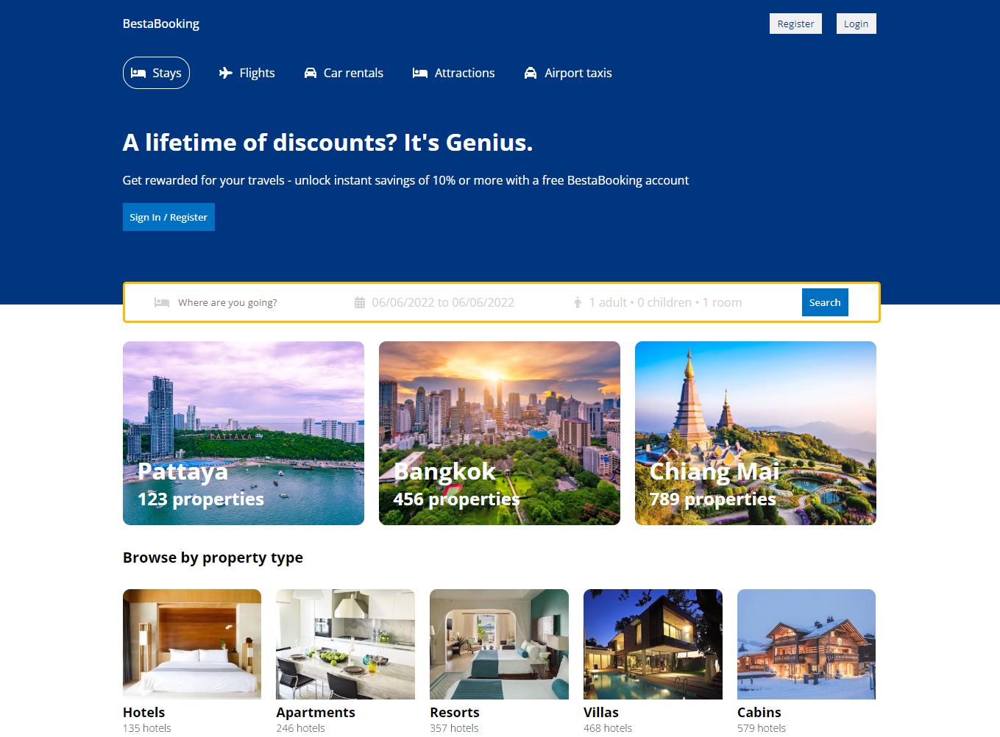
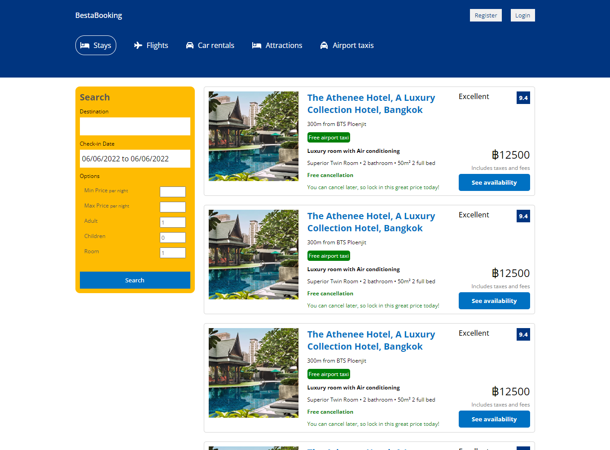
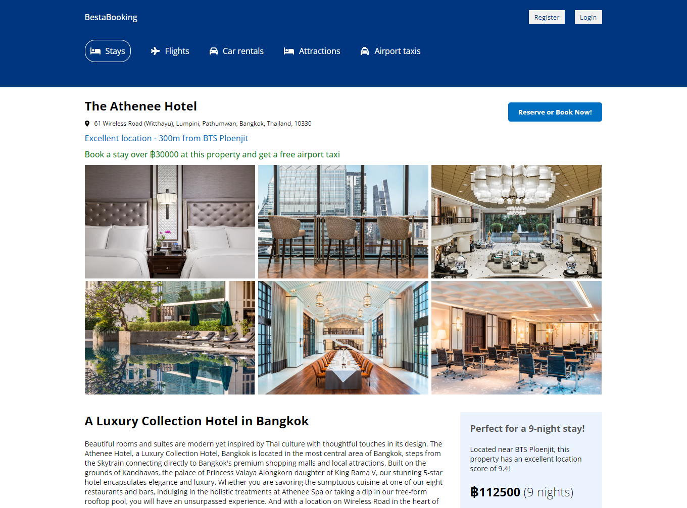

# Development of Online Travel Agency Website

**Development of Online Travel Agency Website** is project which is developed for using advanced frontend development concepts with React core features, React Hooks and React Router to imitate Booking.com website in part of client-side app, using HTML, CSS, JavaScript, React JS and Font Awesome.

---

In the project directory, you must run these commands in terminal:

### `yarn` and `yarn start`

and open [http://localhost:3000](http://localhost:3000) to view it in the browser.
